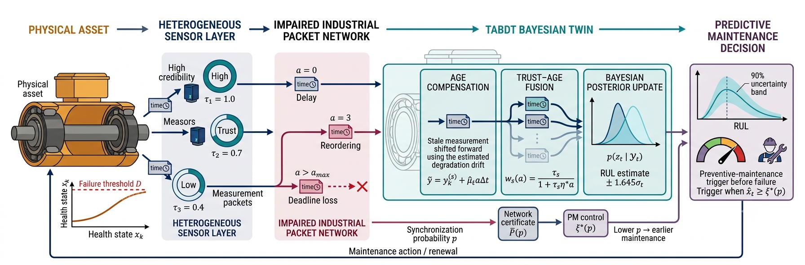
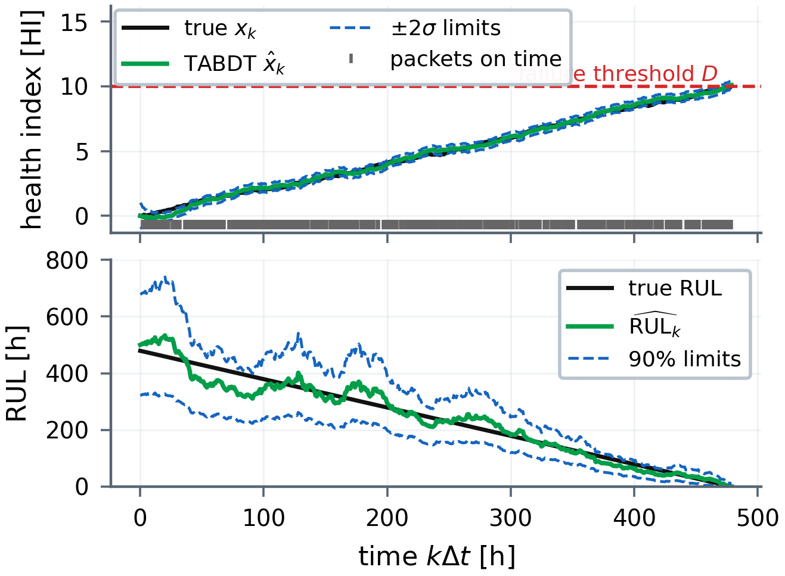
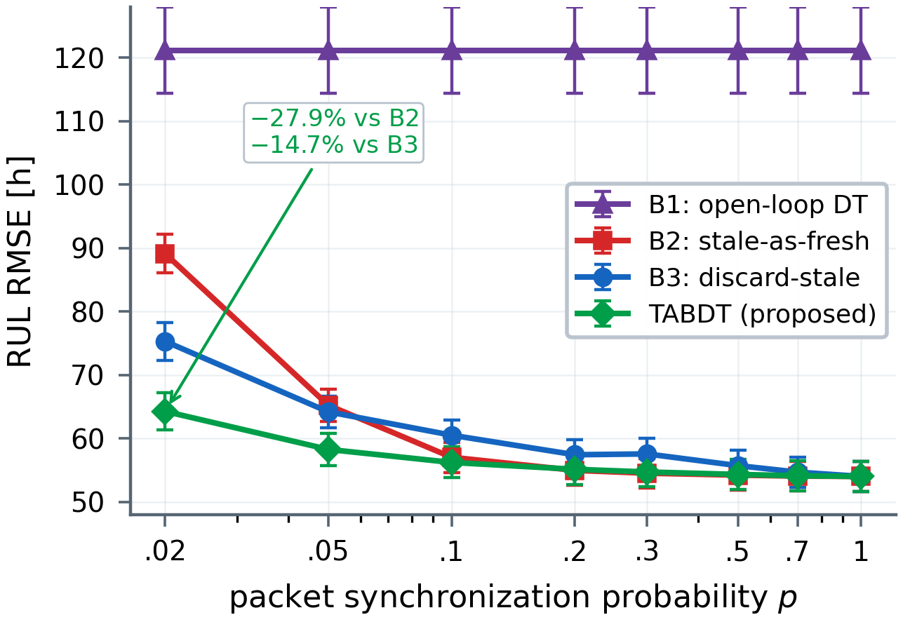
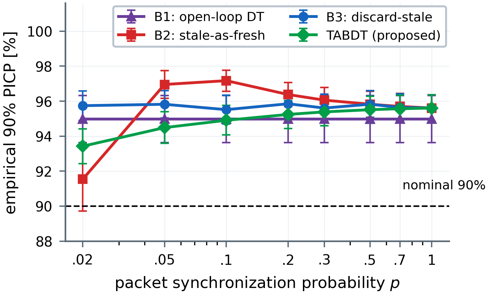
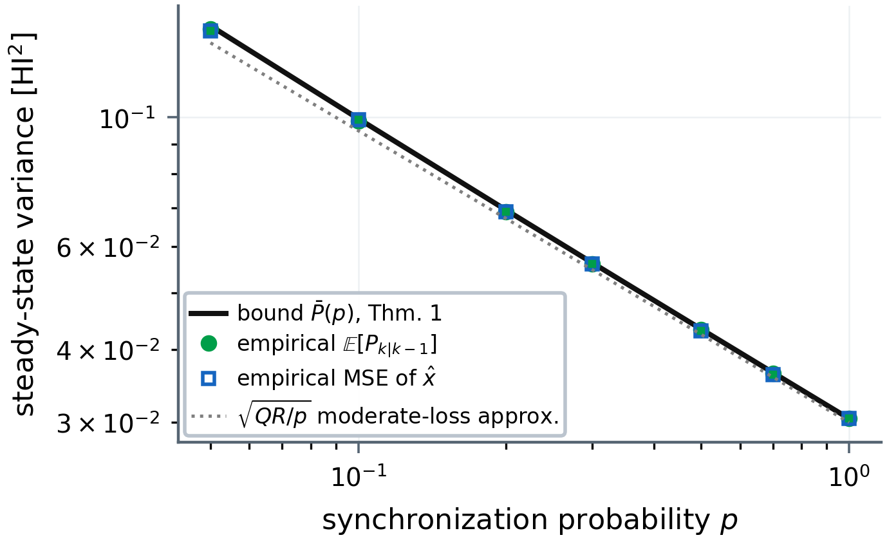
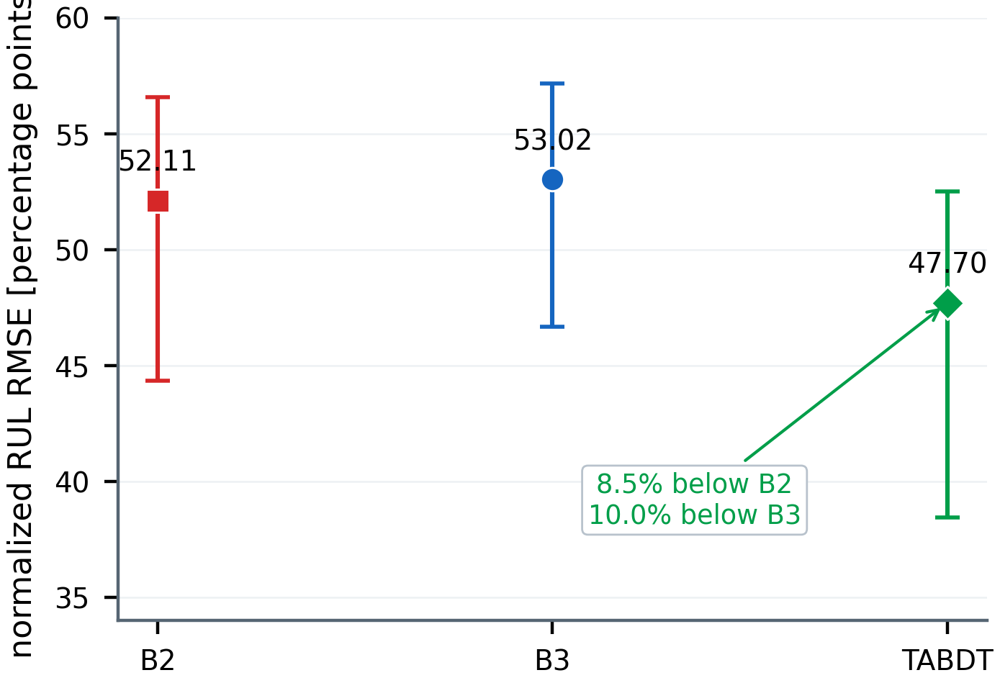
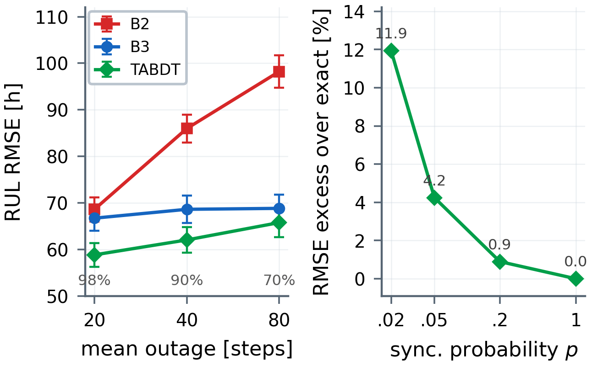
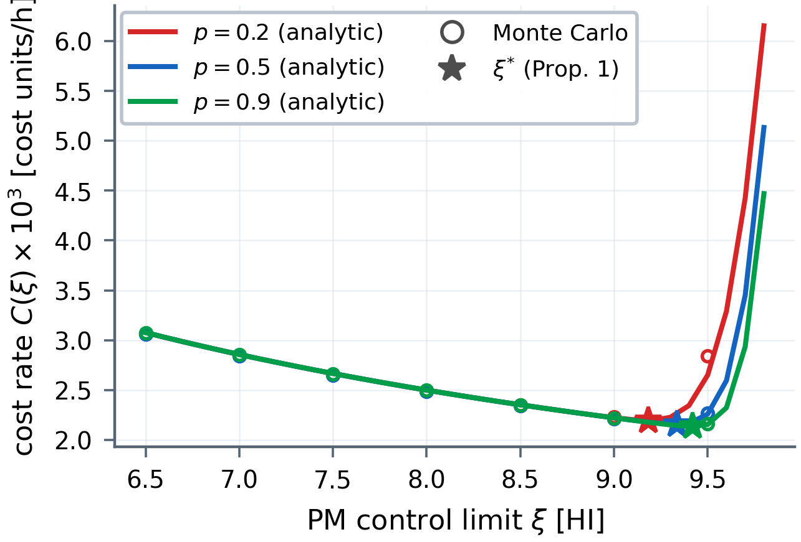
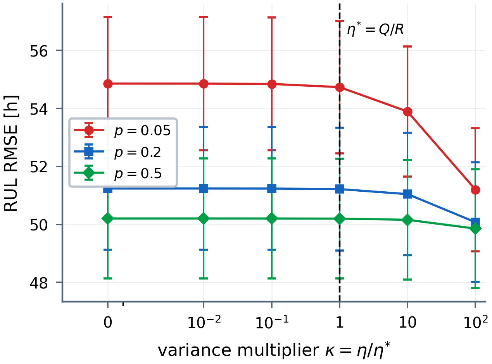

<div align="center">

# TABDT

### Trust and Age Bayesian Digital Twins for Predictive Maintenance

**Provable remaining-useful-life estimation under delayed, reordered, and dropped industrial packets**

[](XJTU_SHA256SUMS.txt)
[](https://doi.org/10.5281/zenodo.21861066)
[](requirements.txt)
[](main.pdf)
[](https://www.ieee-ies.org/pubs/transactions-on-industrial-cyberphysical-systems)
[](#external-xjtu-sy-validation)

[**Read the manuscript**](main.pdf) · [**Archived release v19**](https://doi.org/10.5281/zenodo.21861066) · [**Browse the figures**](#paper-figures) · [**Reproduce the results**](#reproduce-the-results) · [**Cite the work**](#citation)

**Manuscript target:** *IEEE Transactions on Industrial Cyber-Physical Systems (TICPS)*<br>
**Authors:** Yassir Ameen Al-Karawi and Hamed Al-Raweshidy · **Corresponding author:** Hamed Al-Raweshidy

<br>

<a href="figs/fig1_architecture.png">
  
</a>

<sub><b>System overview.</b> Measurements from sensors with heterogeneous trust scores traverse an impaired packet network. TABDT compensates packet age, fuses trust and age in the Bayesian update, predicts RUL, and adapts the preventive-maintenance limit to network quality.</sub>

</div>

---

## Overview

Industrial digital twins often assume synchronized and equally reliable measurements. TABDT removes that assumption. It models geometric packet delay with a finite deadline, packet reordering, deadline loss, and heterogeneous sensor credibility. Arrived observations are aligned to the current time, weighted by trust and age, and fused with a random-effects Wiener degradation model.

The framework connects estimation to maintenance through a closed-form network certificate and a synchronization-aware preventive-maintenance limit. Release **v19** permanently archives the deterministic simulation, external-validation code, machine-readable results, integrity hashes, and manuscript snapshot at [Zenodo DOI 10.5281/zenodo.21861066](https://doi.org/10.5281/zenodo.21861066). The `main` branch contains the submission-ready manuscript with the DOI and updated system overview. Figures are supplied as publication-ready PDF and high-resolution PNG files.

## Results at a glance

| Evaluation | Headline result |
|---|---|
| Synthetic study | 400 simulated units; up to **27.9% lower RUL RMSE** under severe network impairment |
| External XJTU-SY test | All **15 physical bearings**; normalized RUL RMSE **47.70** for TABDT versus **52.11** for B2 and **53.02** for B3 |
| Analytical certificate | Bound-to-empirical-covariance ratio from **1.000 to 1.013** |
| Interval assessment | Synthetic 90% interval coverage **93.4–95.6%**; external coverage **76.9%**, reported as model mismatch rather than field calibration |
| Stress testing | Method ordering remains under bursty Markov outages; approximation gap to exact reprocessing vanishes at perfect synchronization |

## Method in four steps

1. **Age compensation** shifts each stale observation from its sampling time to the current decision time.
2. **Trust–age fusion** reduces the influence of older packets and sensors with weaker credibility.
3. **Bayesian posterior update** propagates state, drift, covariance, and first-passage RUL uncertainty.
4. **Network-aware maintenance** maps the analytical certificate to an earlier maintenance limit as synchronization deteriorates.

## Paper figures

Click any preview for the full-resolution PNG. Each **Vector PDF** link opens the corresponding publication-quality source.

<table>
  <tr>
    <td width="50%" valign="top">
      <a href="figs/fig2_trajectories.png"></a><br>
      <sub><b>Fig. 2 — Representative trajectory.</b> Health and RUL estimates at <i>p</i> = 0.4 with uncertainty limits and timely packet arrivals.</sub><br>
      <a href="figs/fig2_trajectories.pdf">Vector PDF</a>
    </td>
    <td width="50%" valign="top">
      <a href="figs/fig3_rmse_vs_p.png"></a><br>
      <sub><b>Fig. 3 — RUL accuracy versus synchronization.</b> TABDT gains are largest when staleness and deadline loss are most severe.</sub><br>
      <a href="figs/fig3_rmse_vs_p.pdf">Vector PDF</a>
    </td>
  </tr>
  <tr>
    <td width="50%" valign="top">
      <a href="figs/fig4_picp.png"></a><br>
      <sub><b>Fig. 4 — Interval coverage.</b> Empirical coverage of the nominal 90% RUL interval across synchronization conditions.</sub><br>
      <a href="figs/fig4_picp.pdf">Vector PDF</a>
    </td>
    <td width="50%" valign="top">
      <a href="figs/fig5_theorem1.png"></a><br>
      <sub><b>Fig. 5 — Certificate validation.</b> The closed-form bound remains above empirical prior variance and MSE with at most 1.3% slack.</sub><br>
      <a href="figs/fig5_theorem1.pdf">Vector PDF</a>
    </td>
  </tr>
  <tr>
    <td width="50%" valign="top">
      <a href="figs/fig6_xjtu.png"></a><br>
      <sub><b>Fig. 6 — External XJTU-SY validation.</b> Cluster-bootstrap intervals over 15 bearings at <i>p</i> = 0.02.</sub><br>
      <a href="figs/fig6_xjtu.pdf">Vector PDF</a>
    </td>
    <td width="50%" valign="top">
      <a href="figs/fig8_stress.png"></a><br>
      <sub><b>Fig. 7 — Stress tests.</b> Bursty Markov outages and the approximation gap relative to exact delayed-data reprocessing.</sub><br>
      <a href="figs/fig8_stress.pdf">Vector PDF</a>
    </td>
  </tr>
  <tr>
    <td width="50%" valign="top">
      <a href="figs/fig7_cost.png"></a><br>
      <sub><b>Fig. 8 — Maintenance decision.</b> Poorer synchronization moves the optimal preventive-maintenance limit toward earlier intervention.</sub><br>
      <a href="figs/fig7_cost.pdf">Vector PDF</a>
    </td>
    <td width="50%" valign="top">
      <a href="figs/fig6_sensitivity.png"></a><br>
      <sub><b>Supplementary sensitivity.</b> RUL RMSE across the trust–age variance multiplier and network conditions.</sub><br>
      <a href="figs/fig6_sensitivity.pdf">Vector PDF</a>
    </td>
  </tr>
</table>

## Reproduce the results

### 1. Synthetic study

```bash
git clone https://github.com/YassirALKarawi/tabdt-reproducibility.git
cd tabdt-reproducibility
python3 -m pip install -r requirements.txt
python3 tab_dt_simulation.py
```

The simulator uses fixed seeds and common random numbers across network conditions. It regenerates `results.json` and the synthetic-study plots. Fig. 1 is the curated publication overview supplied in `figs/fig1_architecture.png` and is intentionally not overwritten by the simulator.

To compile the manuscript:

```bash
pdflatex main.tex
pdflatex main.tex
pdflatex main.tex
```

<a id="external-xjtu-sy-validation"></a>

### 2. External XJTU-SY validation

Download the official `XJTU-SY_Bearing_Datasets.zip` archive from the dataset authors' public repository. Verify the archive before use:

```text
3cc815649a315ac7da202980c489f33db44ca2db0317bbe3bcb9dcf415375e10
```

Then run:

```bash
python3 xjtu_validation.py \
  --archive /path/to/XJTU-SY_Bearing_Datasets.zip
```

The script verifies the archive, reads 9,216 one-minute records from 15 bearings, regenerates `xjtu_results.json`, and writes `figs/fig6_xjtu.pdf` and `figs/fig6_xjtu.png`. The 5.45 GB archive and derived feature cache are intentionally excluded.

The single-channel test holds a causal tenfold condition-baseline health-to-RUL proxy fixed across methods and isolates the packet-use rule. This proxy is an analysis normalization, not an asserted per-bearing failure threshold.

## Repository map

| Path | Purpose |
|---|---|
| [`main.pdf`](main.pdf) / [`main.tex`](main.tex) | Eight-page manuscript and LaTeX source |
| [`tab_dt_simulation.py`](tab_dt_simulation.py) | Deterministic synthetic experiment |
| [`results.json`](results.json) | Raw synthetic-study results |
| [`xjtu_validation.py`](xjtu_validation.py) | Deterministic XJTU-SY external validation |
| [`xjtu_results.json`](xjtu_results.json) | Bearing-level, repetition-level, and aggregate validation results |
| [`figs/`](figs/) | Vector PDF figures and 400-dpi PNG previews |
| [`XJTU_SHA256SUMS.txt`](XJTU_SHA256SUMS.txt) | Machine-checkable v19 integrity hashes |
| [`requirements.txt`](requirements.txt) | Tested Python dependencies |
| [`CITATION.cff`](CITATION.cff) | Citation metadata for GitHub and reference managers |
| [`.zenodo.json`](.zenodo.json) | Zenodo release metadata with the two manuscript authors |
| [`LICENSE`](LICENSE) / [`LICENSES.md`](LICENSES.md) | Software license and file-specific rights statement |

## Validation and integrity

<details>
<summary><b>Show the built-in scientific checks</b></summary>

- Fixed-drift first-passage time: Monte Carlo mean 501.3 h versus the inverse-Gaussian value 500.0 h; standard deviation 33.6 h versus 33.5 h.
- At `p = 1`, B2, B3, and TABDT are numerically identical.
- The primary external aggregate uses all 15 bearings and 40 network repetitions per bearing. Repetitions are never counted as independent physical specimens.
- The prespecified ≥100-record cohort is retained only as a 13-bearing long-life sensitivity: B2 52.16, B3 53.01, and TABDT 47.77 percentage points; interval coverage is 76.7%.
- Paired bearing-clustered bootstrap intervals for the B2 and B3 absolute reductions are 3.59–6.72 and 4.12–9.56 percentage points.
- A between-bearing factor sweep from 1 to 2 changes external coverage from 72.4% to 84.5%, so undercoverage is reported rather than hidden.
- The Gilbert–Elliott test holds the timely fraction at 0.05 while increasing the mean outage length from 20 to 40 and 80 steps.
- Exact reprocessing recomputes the delayed-data posterior from every arrived packet on a common 25-step grid and coincides with the sequential filter at `p = 1` by construction.

</details>

Verify the synchronized external-validation artifacts from the repository root:

```bash
sha256sum -c XJTU_SHA256SUMS.txt
```

<details>
<summary><b>Show the v19 XJTU-SY hashes</b></summary>

```text
0b21b49826dd09d2724c6c64ccc95b5b549dd7b8181b38aa944a721ea0f8e39e  xjtu_validation.py
2ac720e6525d15aa8c946fd7cd75a8ea109df168945f435d8376e26d2d47d4b3  xjtu_results.json
b904248a4aa8f02857f377157b7f0a0ff0334515fce7a3ab765aad0ff6fbd7fb  figs/fig6_xjtu.pdf
c8c2bc48c9c0b819aad1618f50fa4604d15bda0c5d56fdf5bf638b8a27f53cc7  figs/fig6_xjtu.png
```

</details>

## Manuscript and authorship record

- **Target venue:** *IEEE Transactions on Industrial Cyber-Physical Systems (TICPS)*.
- **Authors:** Yassir Ameen Al-Karawi and Hamed Al-Raweshidy; no additional authors are listed in the manuscript or archival metadata.
- **Corresponding author:** Hamed Al-Raweshidy.
- **Code availability:** the manuscript links to this public repository and to the immutable Zenodo v19 archive.
- **Archived software DOI:** [10.5281/zenodo.21861066](https://doi.org/10.5281/zenodo.21861066).

## Citation

GitHub exposes the repository citation through [`CITATION.cff`](CITATION.cff), while [`.zenodo.json`](.zenodo.json) supplies matching metadata for release archiving. Cite the archived reproducibility package as:

```bibtex
@software{alkarawi2026tabdt,
  author = {Yassir Ameen Al-Karawi and Hamed Al-Raweshidy},
  title  = {TABDT: Trust and Age Bayesian Digital Twins Reproducibility Package},
  version = {v19},
  year   = {2026},
  publisher = {Zenodo},
  doi    = {10.5281/zenodo.21861066},
  url    = {https://doi.org/10.5281/zenodo.21861066}
}
```

## Authors

- **Yassir Ameen Al-Karawi** — first author · Department of Communications Engineering, College of Engineering, University of Diyala, Iraq · [ORCID](https://orcid.org/0000-0003-2959-3893) · [GitHub](https://github.com/YassirALKarawi)
- **Hamed Al-Raweshidy** — Wireless Networks and Communications Centre, Brunel University London, UK · [ORCID](https://orcid.org/0000-0002-3702-8192) · corresponding author

## Licensing

The Python source code is released under the [MIT License](LICENSE). The manuscript and paper figures retain the authors' publication rights; file-specific terms and the excluded XJTU-SY dataset status are documented in [`LICENSES.md`](LICENSES.md).

---

<div align="center">
  <sub>Experimental code and results are permanently archived as v19 at DOI 10.5281/zenodo.21861066; the main branch carries the submission-ready manuscript and figure update.</sub>
</div>
